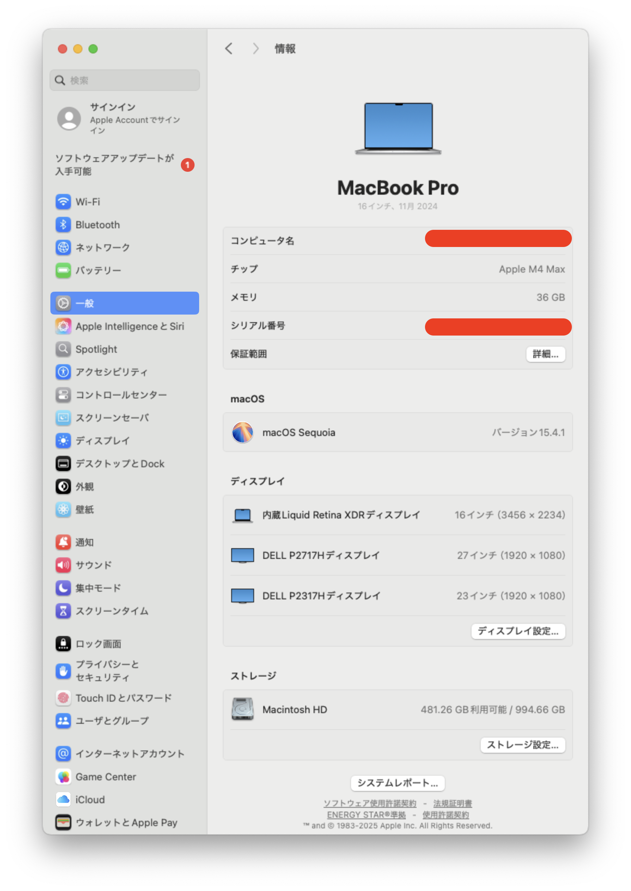
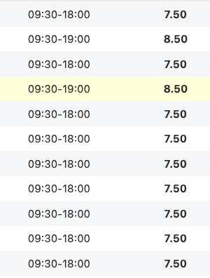
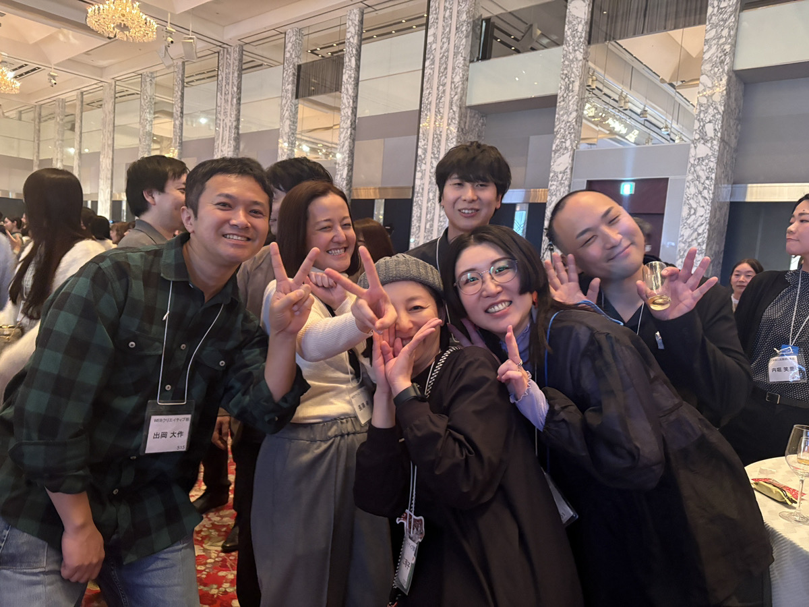
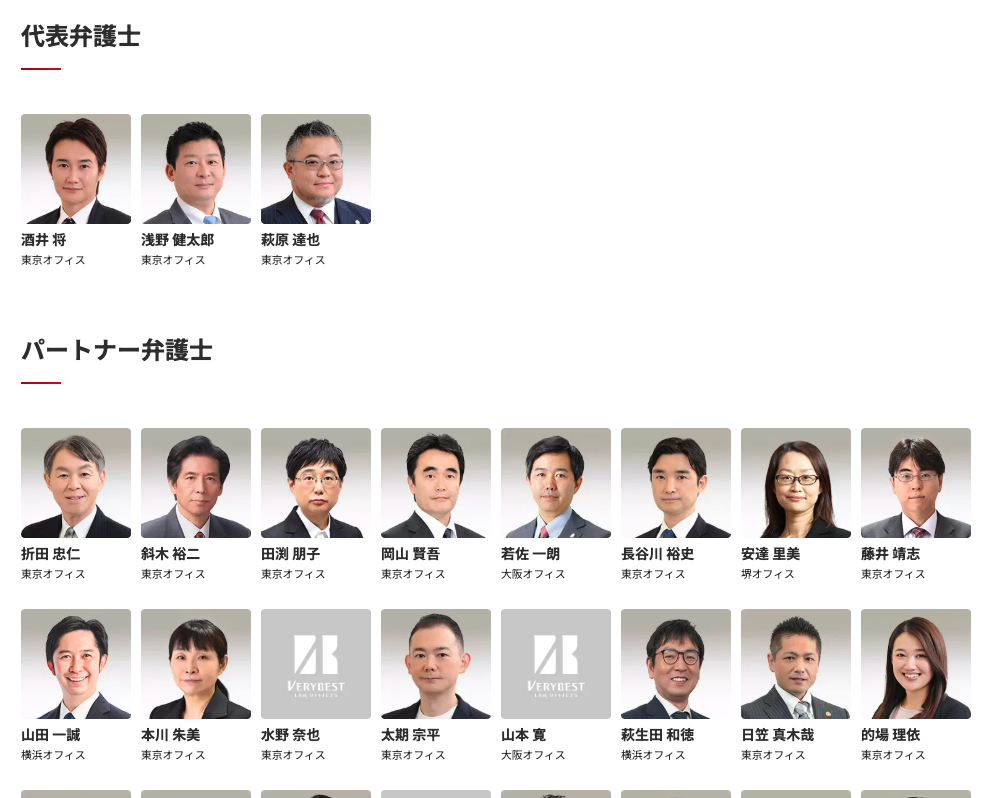
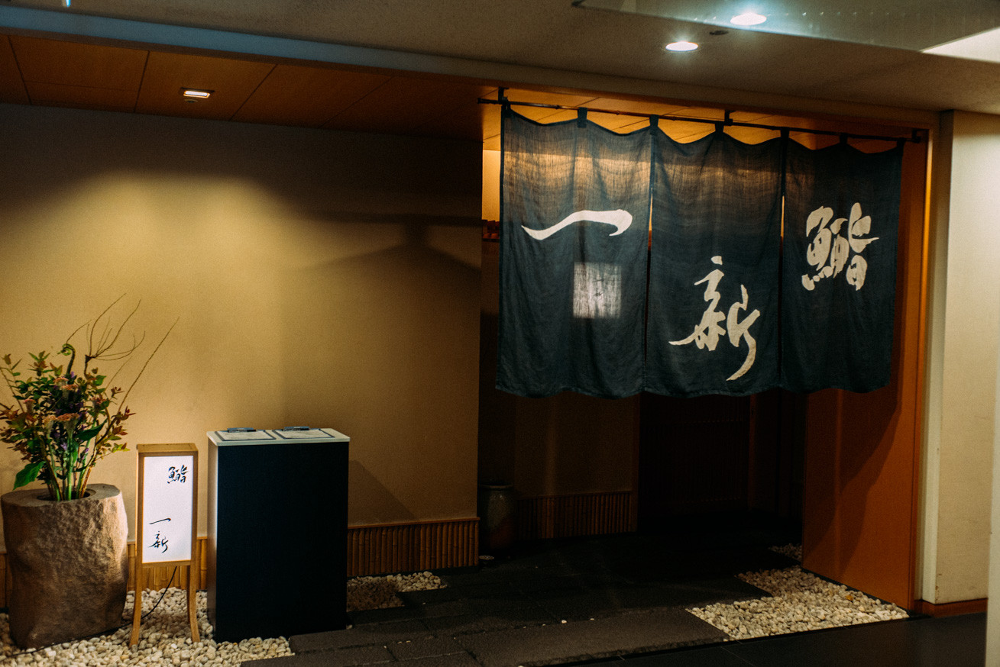

# ベリーベストの良いところ・悪いところ

**Beer Bash LT**

---

## 自己紹介

---

### 福島はやと

- WEBエンジニア
  - PHP(Laravel)/JavaScript
  - 一人でいるときは音楽orラジオ聞いてます。

脂肪がなくて毛根があるときの僕→

---

## 🎉 良いところ

---

### リモートワーク & 環境

- **ほぼフルリモート可能**
  - 柔軟な働き方ができる

---

### リモートワーク & 環境

- **支給されるMacがめっちゃいいやつ**
  - 開発環境に妥協なし

● Apple M4 Max / メモリ36GB / ストレージ 1TB

---

### 働きやすさ

- **業務時間が7時間30分**
  - ワークライフバランス◎

定時勤務で7.5時間高速

お昼休み抜いたら**6.5時間勤務！**

---

### 働きやすさ

- **みんないい人**

まじで。本当に、信じて、お願い✋️

---

### チャレンジできる環境

- **手を上げれば任せてくれる!**
  - 主体性を重視

● ベトナム行きたい！で4月🇻🇳行くことに！

※ ただし、目的性や妥当性は必要！

---

- **有料サービスも業務に役立つものは積極採用**
  - Cursorなど、生産性向上ツールの導入に前向き

妥当性があれば、会社がお金払ってくれます。

---

### 法務の専門性

- **弁護士の意見が聞ける**
  - 法律面での不安を解消できる貴重な環境

弁護士数国内有数です。

---

## 🌏 オフショア開発体制

---

### beetechとの連携

- **beetechを買収済み**
  - 今後連携を強めていく、、、かも🦆

---

### beetechとの連携

- **皆さんの仕事も受注して対応可能!**
  - 開発依頼したい場合はお声掛けください！

●連携して行きましょう！

---

## 😅 悪いところ

---

### コミュニケーション

- **Slackメインで使ってない**

一部Slack利用してますが会社メインはchatworkです

---

### 文化・手続き

- **弁護士事務所ということでちょっとお硬い**
- **業務手続きが最初は複雑かも?**
  - 書類を印刷して捺印提出
  - Redmineで週報と日報の両方記載、など

※ ただ、服装はめちゃ自由

---

### 福利厚生

- **健保がITSじゃない**
  - ITベンチャー系出身者慟哭レベル

寿司 一新(いっしん)に行けません。

---

### その他

- **名前と顔が永遠に一致しない**
  - リモートワークあるあるですね😅

---

## まとめ

- ✅ 働きやすい環境と自由度の高さ
- ✅ オフショア活用で開発リソース確保
- ⚠️ ベンチャーとは少し違う文化
- ⚠️ 手続き面での慣れは必要

**総じて、エンジニアとして成長できる良い環境!** 🎊

---

## ご清聴ありがとうございました! 🍺

---

